[<- back](README.md)

# Remote Programming of Raspberry Pi using PyCharm
This tutorial is about using PyCharm IDE on a Windows machine to remotely execute Python programs on Raspberry Pi. This step by step tutorial on how to remotely connect PyCharm to Raspberry Pi and use the Raspberry Pi python interpreter to execute the programs is tested on a Windows 10 machine and Raspberry Pi running Raspbian OS.

1. Step by step configuration
2. Create git repository
3. Share on GitHub
4. Debug DISPLAY configuration
5. Credits
6. Author

## 1. Step by step configuration

#### Step 1: 
Ensure the Windows Machine and Raspberry Pi are part of the same Network.

### Step 2:
Install PyCharm Professional Edition on your Windows machine.

### Step 3:
You need to get the IP Address of Raspberry Pi. To do so, open the Terminal window on raspberry pi and type the following command **ifconfig** (here it's **192.168.1.42**):
```bash
pi@raspberrypi:~ $ ifconfig
eth0: flags=4163<UP,BROADCAST,RUNNING,MULTICAST>  mtu 1500
        inet 192.168.1.42  netmask 255.255.255.0  broadcast 192.168.1.255
        inet6 2a01:cb15:811a:800:ca7b:d8b1:eef3:94d0  prefixlen 64  scopeid 0x0<global>
        inet6 fe80::b77f:4360:7571:b634  prefixlen 64  scopeid 0x20<link>
        ether b8:27:eb:b4:2b:f9  txqueuelen 1000  (Ethernet)
        RX packets 829885  bytes 309193514 (294.8 MiB)
        RX errors 0  dropped 85330  overruns 0  frame 0
        TX packets 163367  bytes 16088873 (15.3 MiB)
        TX errors 0  dropped 0 overruns 0  carrier 0  collisions 0

lo: flags=73<UP,LOOPBACK,RUNNING>  mtu 65536
        inet 127.0.0.1  netmask 255.0.0.0
        inet6 ::1  prefixlen 128  scopeid 0x10<host>
        loop  txqueuelen 1000  (Local Loopback)
        RX packets 41  bytes 2444 (2.3 KiB)
        RX errors 0  dropped 0  overruns 0  frame 0
        TX packets 41  bytes 2444 (2.3 KiB)
        TX errors 0  dropped 0 overruns 0  carrier 0  collisions 0

wlan0: flags=4099<UP,BROADCAST,MULTICAST>  mtu 1500
        ether b8:27:eb:e1:7e:ac  txqueuelen 1000  (Ethernet)
        RX packets 0  bytes 0 (0.0 B)
        RX errors 0  dropped 0  overruns 0  frame 0
        TX packets 0  bytes 0 (0.0 B)
        TX errors 0  dropped 0 overruns 0  carrier 0  collisions 0
```

### Step 4:
Create props project folder on the Raspebrry:
```bash
pi@raspberrypi:~/Room $ pwd
/home/pi/Room
pi@raspberrypi:~/Room $ mkdir PyTvScripter
pi@raspberrypi:~/Room $ ls
PyTvScripter  Relay
pi@raspberrypi:~/Room $ 
```

### Step 5:
Invoke your PyCharm IDE. Create a new Project. Go to File —> New Project —> Pure Python —> Give a Project Name. In this case it is PyTvScripter.

### Step 6:
Right Click on PyTvScripter and select New —> Python File and give a name to python file. In this case it is tvscripter.py

### Step 7:
Write the line `print("Hello RaspberryPi")` in the editor.

### Step 8:
Now go to File —> Settings —> Project: PyTvScripter —> Project Interpreter

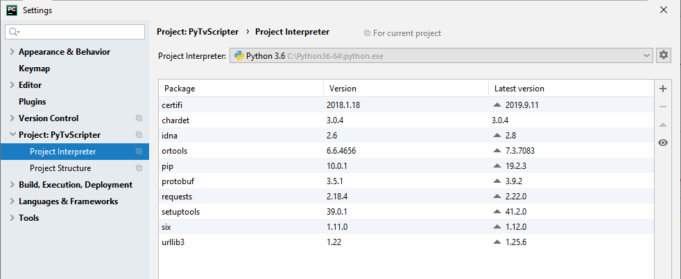

### Step 9:
On the right pane of the window, click on teh gear button at the end of Project Interpreter and select Add... Then select SSH Interpreter and fill in the New server configuration with the Raspberry IP address and *pi* user, then Apply:

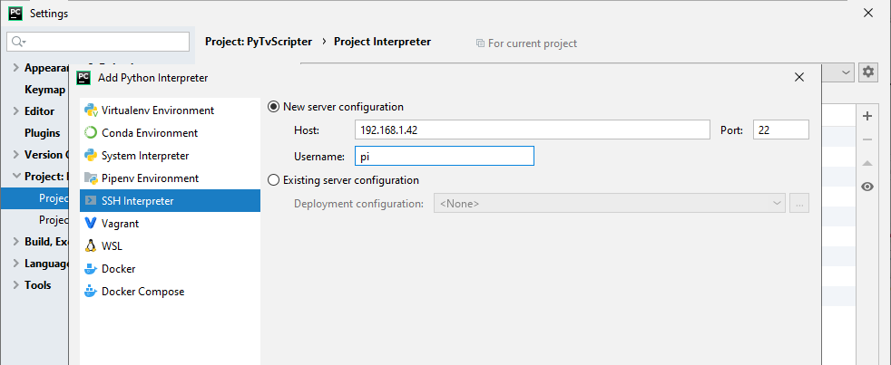

### Step 10:
Complete with credentials for *pi* user:

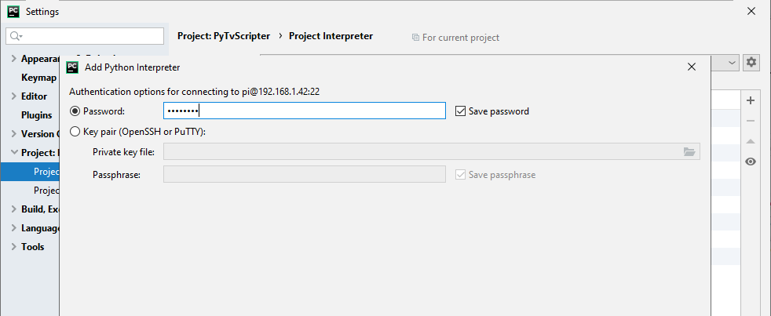

### Step 11:
When connected to the Raspberry, browse remote drive to select **Python 3** interpreter:

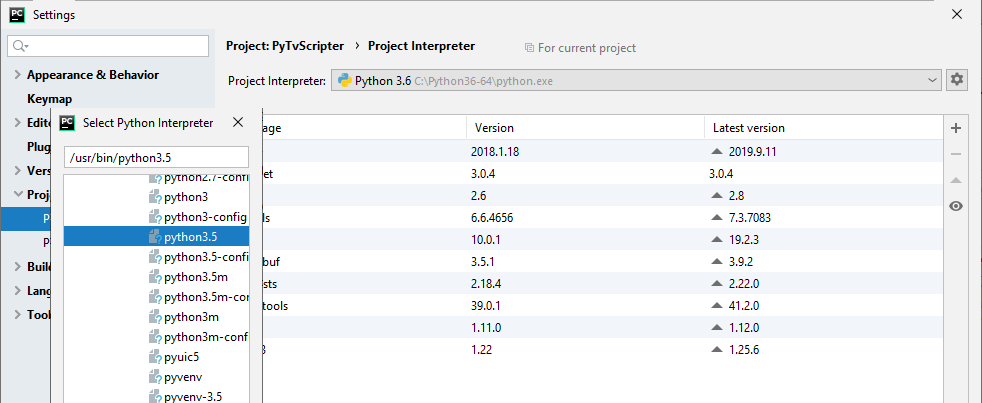

Remote SSH interpreter is now configured:

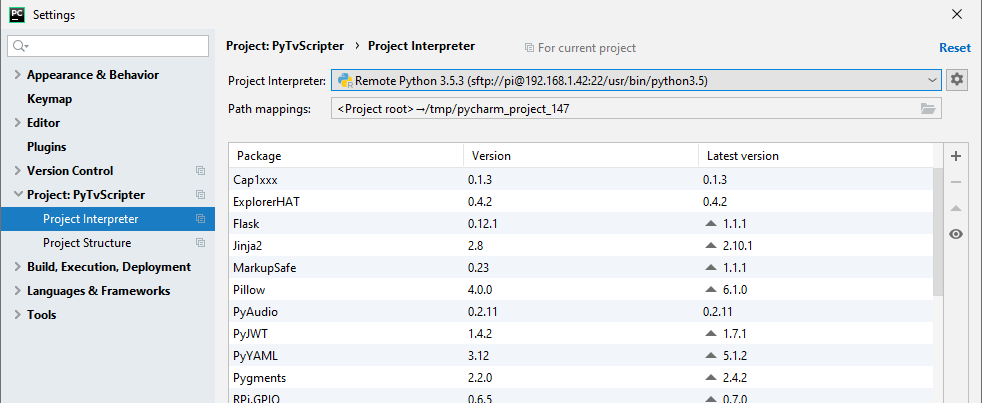

Now on Apply, deployment configuration is created automatically:

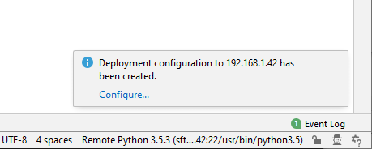

### Step 12:
Click Configure... —> Mappings and set the correct path for deployment on the Raspberry:


Now go to File —> Settings —> Project: PyTvScripter —> Project Interpreter to check SSH configuration is completed:

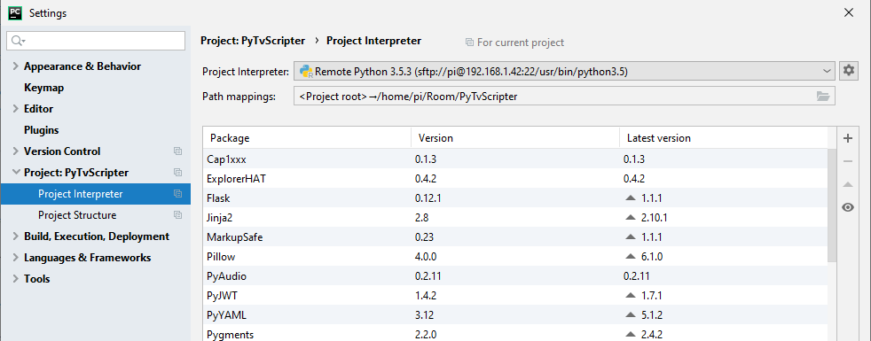

### Step 13:
Now we need to upload the Python file created on our Windows machine on to Raspberry Pi and compile the program using Raspberry Pi Python Interpreter.

Select PyTvScripter folder in Project left panel and go to Tools —> Deployment —> Upload to pi@192.168.1.42:22:

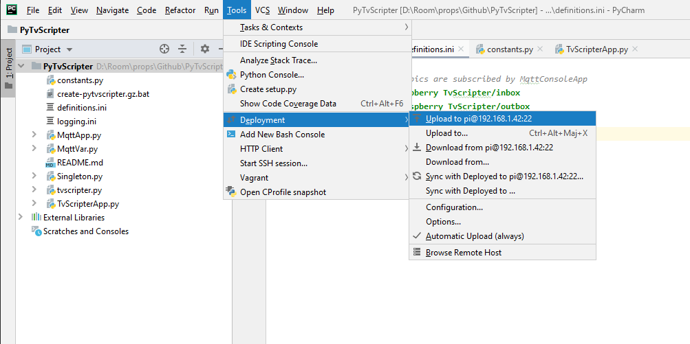

### Step 14:
Click Add Configuration... button to add a Python Remote Debug configuration:
* you don't have to do anything else (despite what is mentioned in the screenshot below, I guess PyCharm current version 2019.3 does it for us)

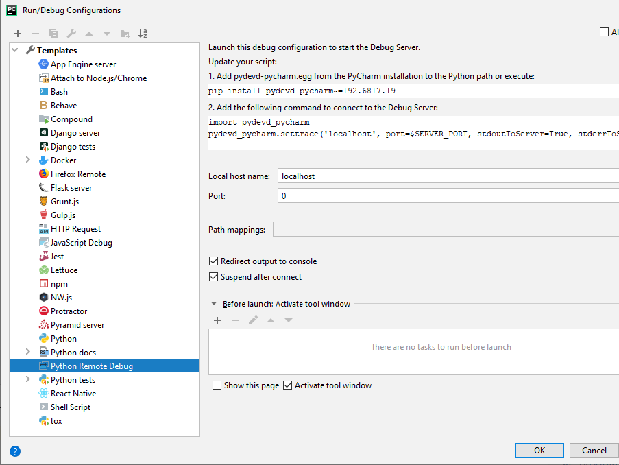

### Step 15:
Now got to Run —> Debug and start the remote debugging:

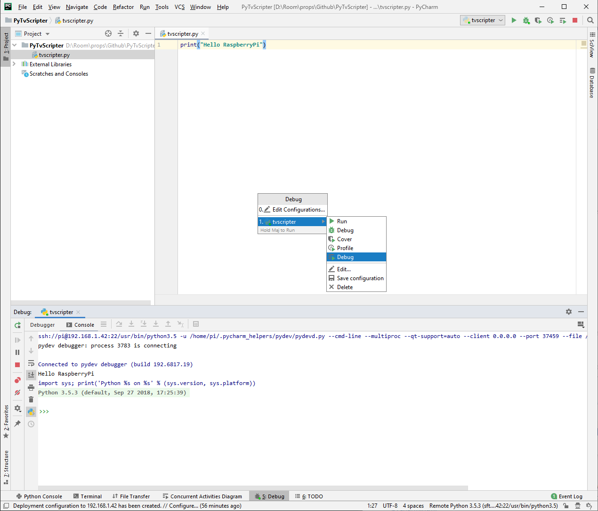

### Step 16:
Verify the Debug configuration:

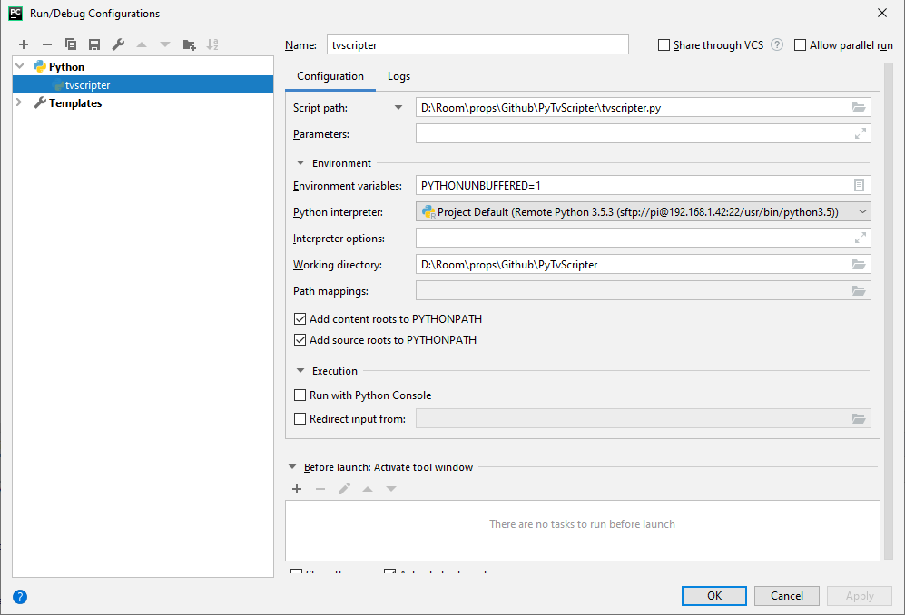

### Step 17:
Start debug and select Debug panel:

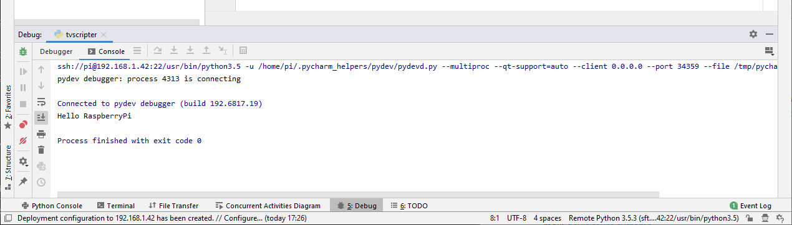

### Step 18:
At first start, TvScripter App has created two files:
* .config.yml
* pytvscripter.log

Synchronize with the Raspberry:

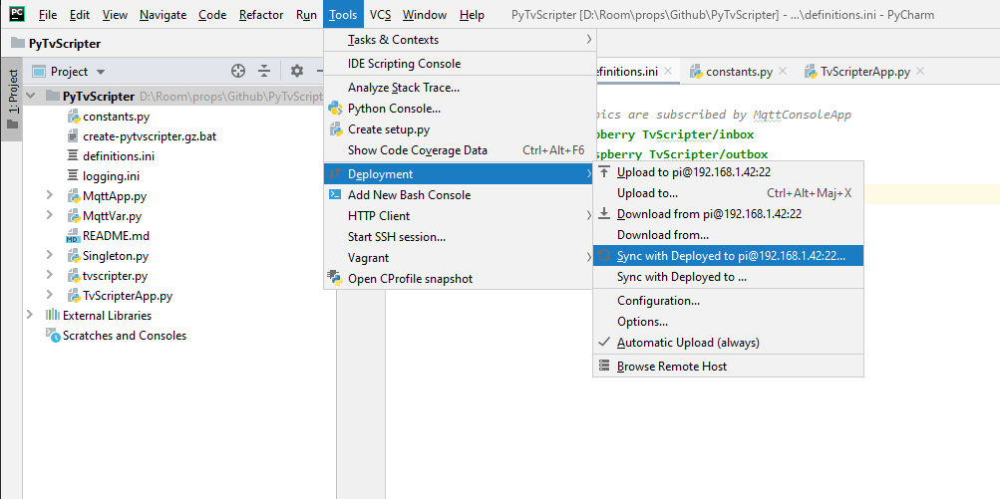

Click the synhronize button in the synchronization dialog:

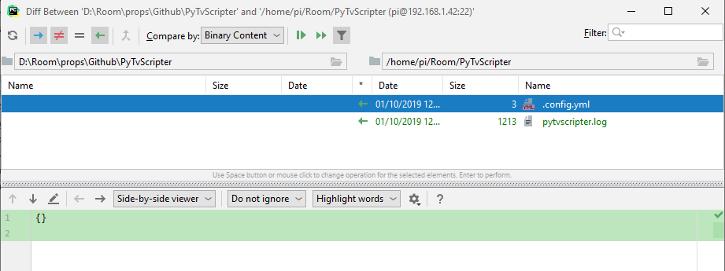

**Voilà!** We can start working on our PyTvScripter project...


## 2. Create *git* repository
Go to VCS —> Import into version Control —> Create Git Repository...

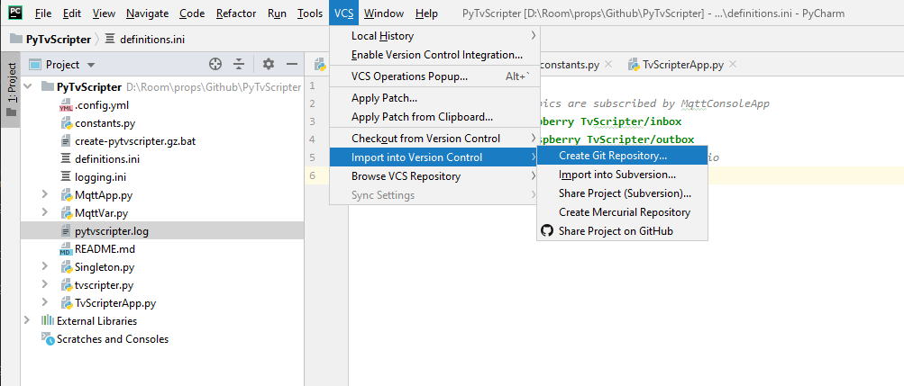

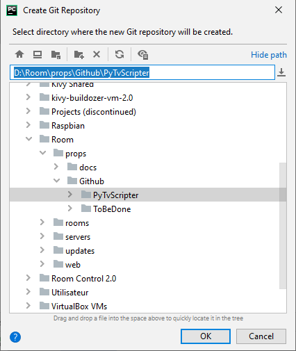


## 3. Share on GitHub
Go to VCS —> Import into version Control —> Share Project on GitHub... and login with you credentials

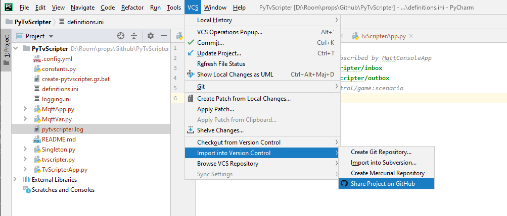


Complete the repository description and share:

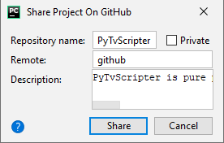

**Do not add *.idea*** folder:

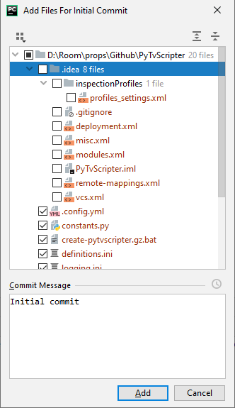

If you missed it, you can remove *.idea* from git with:
```bash
$ git rm --cached -r .idea
```


## 4. Debug DISPLAY configuration
To run remote application in GUI (for *guizero* for example), add DISPLAY configuration in session environment variables:


## 5. Credits

This guide is an adaptation of *Remote Programming of Raspberry Pi using PyCharm* by Gowrishankar S, published in 2016 at <a href="https://www.gowrishankarnath.com/remote-programming-of-raspberry-pi-using-pycharm.html" target="_blank">https://www.gowrishankarnath.com/remote-programming-of-raspberry-pi-using-pycharm.html</a>


## 6. Author

**Marie FAURE** (Oct 1th, 2019)
* company: FAURE SYSTEMS SAS
* mail: <a href="mailto:dev@faure.systems" target="_blank">dev@faure.systems</a>
* github: <a href="https://github.com/fauresystems?tab=repositories" target="_blank">fauresystems</a>
* web: <a href="https://www.live-escape.net/" target="_blank">Live Escape Grenoble</a>